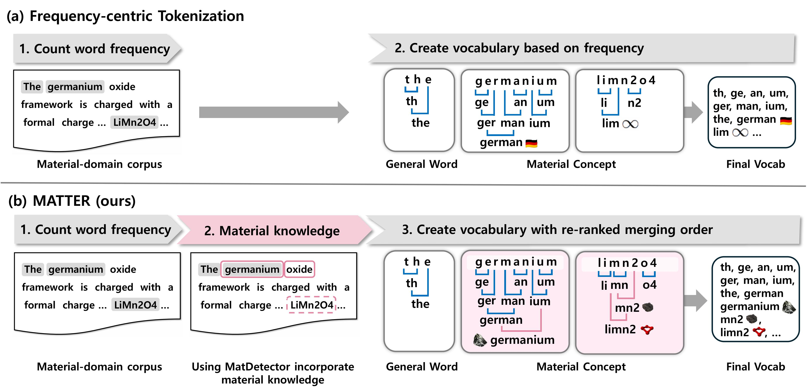

# MATTER
✨ [ACL 2025] Incorporating Domain Knowledge into Materials Tokenization

<div align="center">
  
</div>

----

## STEP1 : Extract Material Concepts with MatDetector
The training data for **MatDetector**, which extracts material concepts and their probabilities, is only shared as DOIs due to copyright issues. 
However, with a free API key from Semantic Scholar, you can crawl the papers using those DOIs to get the training data.

We’ve included code for crawling, NER, and adding noise to make the data more robust. Using this, you can build an NER dataset and train MatDetector with the provided training script.
All data-related resources are stored in the following folder:

```python
## doi
MatDetector/data/doi.zip

## data create
MatDetector/data/

## training MatDetector
MatDetector
```

To make things easier, we also released a pretrained MatDetector and a demo. If you're using the MATTER framework, you can use this model and the released tokenization code to build a tokenizer for your own corpus.

```python
MatDetector/ckp
```

----


## STEP2: create MATTER tokenization 


### Installing requirements
```python
cd code
bash install_requirements.sh
```


For MATTER Tokenization training, use this code.     
you can choose lambda in there.
```python
run_MATTER.sh
```

----

## STEP3: Training with MATTER tokenization

```python
train.sh
```


----

## Eveluation

### Generation

```python
cd eval/generation/
bash run.sh
```

### Clssification


```python
cd eval/classification/
```

#### NER
```python
cd ner
# If the model uses a BPE-based tokenizer, run.sh with ner_BPE.py
# otherwise, run.sh with ner.py
run.sh
```

#### RC
```python
cd relation_classification
# If the model uses a BPE-based tokenizer, run.sh with relation_classification_BPE.py
# otherwise, run.sh with relation_classification.py
run.sh
```

#### CLS

```python
cd cls
run.sh
```

